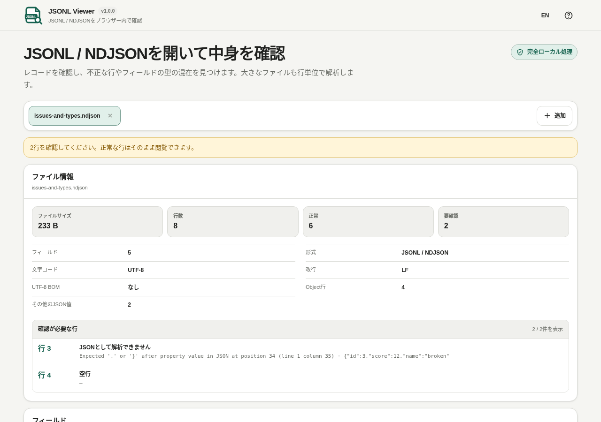

# JSONL Viewer

[](https://github.com/ttomohisa/htmlapps-jsonl-viewer/actions/workflows/deploy-pages.yml)
[](LICENSE)
[](https://ttomohisa.github.io/htmlapps-jsonl-viewer/)

[English README](README.md)

JSONL / NDJSONファイルを外部へアップロードせず、不正行・フィールド出現率・型の混在・レコードをブラウザ内だけで確認できる単一HTMLビューアです。

## 🚀 デモ

### [GitHub PagesでJSONL Viewerを開く](https://ttomohisa.github.io/htmlapps-jsonl-viewer/)

GitHub Pagesから最初のHTMLを読み込んだ後、選択したファイルは端末内で読み込み・処理されます。アプリからファイル内容を外部サーバーへアップロードしません。

[](https://ttomohisa.github.io/htmlapps-jsonl-viewer/)

## 主な機能

- **大きなJSONL / NDJSONを端末内で走査** — `.jsonl` / `.ndjson` / `.jsonl.txt` / `.ndjson.txt` をローカルBlob Workerで行単位に解析します。
- **問題行があっても正常行を確認** — 不正JSONや空行を「要確認」として数えつつ、正常なレコードはそのまま閲覧できます。
- **フィールド出現率と型の混在を確認** — トップレベルフィールドの出現率、観測されたJSON型、number / string / nullなどの型混在を確認できます。
- **全レコードを保持しない** — 初回走査では疎なチェックポイントを保持し、ページ移動時に必要な範囲だけ再読込します。
- **Table / Record表示** — 表形式と整形JSON表示を切り替え、Cell Inspectorで値全体を確認できます。
- **現在ページを出力** — 正常な現在ページをJSONLとしてコピー、またはCSVとしてコピー／保存できます。
- **複数ファイルを扱う** — 複数ファイルを同時に開け、解析状態・問題行・データはファイルごとに分離されます。解析中のタブを閉じるとその解析を中止し、残りのファイルの解析を続けます。

## すぐに使う

### Webで使う

[デモを開く](https://ttomohisa.github.io/htmlapps-jsonl-viewer/)だけで利用できます。インストールやアカウント登録は不要です。

### 単一HTMLをダウンロードして使う

1. リポジトリから [`dist/index.html`](https://github.com/ttomohisa/htmlapps-jsonl-viewer/blob/main/dist/index.html) をダウンロードします。
2. 最新のChromiumベースブラウザ、Firefox、Safariで直接開きます。

`dist/index.self-extract.html` も収録しています。こちらはブラウザ内で可読版HTMLを復元してから起動するSelf-extract版です。

### ローカルでビルドする

1. このリポジトリをダウンロードまたはクローンします。
2. Windowsで `build-standalone.bat` をダブルクリックします。
3. `dist/index.html` と `dist/index.self-extract.html` が生成され、単一HTMLとして検証されます。
4. 生成されたHTMLを端末上で直接開きます。

Python、Node.js、ローカルWebサーバーは不要です。Windows PowerShellと標準の `tar.exe` を使用します。

## 使い方

1. `.jsonl` / `.ndjson` / `.jsonl.txt` / `.ndjson.txt` を1つ以上追加します。
2. 端末内の解析が完了すると、総行数・正常行・要確認行が表示されます。
3. 検出されたフィールド、出現率、型の混在を確認します。
4. 不正JSONや空行がある場合は問題行を選んで該当ページへ移動します。
5. Table / Recordを切り替え、必要に応じてCell Inspectorで値全体を確認します。
6. 現在ページの正常行をJSONLとしてコピー、または現在ページをCSVとしてコピー／保存します。

## GitHub Pagesで公開する

このリポジトリには、単一HTMLをビルドして `dist/` をGitHub Pagesへ自動公開するワークフローが含まれています。

1. リポジトリ名を `htmlapps-jsonl-viewer` としてGitHubへプッシュします。
2. **Settings → Pages → Build and deployment → Source** で **GitHub Actions** を選択します。
3. `main` ブランチへプッシュするか、Actions画面から **Deploy standalone app to GitHub Pages** を手動実行します。
4. ビルド成功後、`https://ttomohisa.github.io/htmlapps-jsonl-viewer/` で公開されます。

`main` へのプッシュ時にはリポジトリ検査、単一HTMLの再生成、検証を行い、GitHub Pagesが有効な場合に確認済みの `dist/` を公開します。

## 開発とビルド

```text
.
├─ src/index.template.html       # アプリ本体のテンプレート
├─ app.config.json               # アプリ情報・バージョン・ビルド設定
├─ dependencies.json             # 実行時依存の宣言
├─ dependencies.lock.json        # 依存ロック情報
├─ build-standalone.bat          # Windows用ビルド入口
├─ build-standalone.ps1          # 単一HTMLビルダー
├─ scripts/check-repository.ps1  # リポジトリ／ビルド検査
├─ dist/index.html               # 可読版の単一HTML
├─ dist/index.self-extract.html  # Self-extract版の単一HTML
└─ .github/workflows/
   ├─ build-standalone.yml       # ビルド検証
   └─ deploy-pages.yml           # GitHub Pages自動公開
```

### ビルドと検査

```bat
build-standalone.bat
```

リポジトリ検査だけを直接実行する場合：

```powershell
powershell.exe -NoLogo -NoProfile -ExecutionPolicy Bypass -File .\scripts\check-repository.ps1
```

ビルド／検査では、依存ロック、未置換プレースホルダー、実行時通信の制約、単一HTML生成、Self-extract版の生成・復元検証などを確認します。

## プライバシーと通信防止

生成された単一HTMLには `connect-src 'none'` を含むContent Security Policyがあります。選択したファイルはブラウザのFile APIで読み込まれ、端末内に留まります。アプリはAnalytics、Telemetry、外部API、実行時CDNを必要としません。

GitHub Pages版では最初のHTML配信だけ通信が発生します。その後、選択したファイルはアプリ内でローカル処理されます。ネットワークを完全に切って使う場合は `dist/index.html` を直接開いてください。

全体走査は単一HTML内のコードから生成したBlob Workerで実行され、外部サーバーへ通信しません。

## 制限事項

- `.jsonl.gz` / `.ndjson.gz` には対応していません。
- 元のJSONL / NDJSONを修復・編集する機能はありません。
- ソートは現在ページが対象で、ファイル全体を並べ替えるものではありません。
- JSON Schema検証、JSONPath、jq相当のクエリは対象外です。
- フィールド統計はトップレベルフィールドを対象としています。

## 依存関係

JSONL Viewer v1.0.0 は、実行時のサードパーティJavaScriptライブラリを同梱していません。

形式・プロジェクトに関する補足は [THIRD_PARTY_NOTICES.md](THIRD_PARTY_NOTICES.md) を確認してください。

## コントリビューション

バグ報告や機能提案はGitHub Issuesからお願いします。開発への参加方法は [CONTRIBUTING.md](CONTRIBUTING.md) を確認してください。

## ライセンス

Copyright © 2026 ttomohisa

このプロジェクトは [MIT License](LICENSE) で公開されています。
