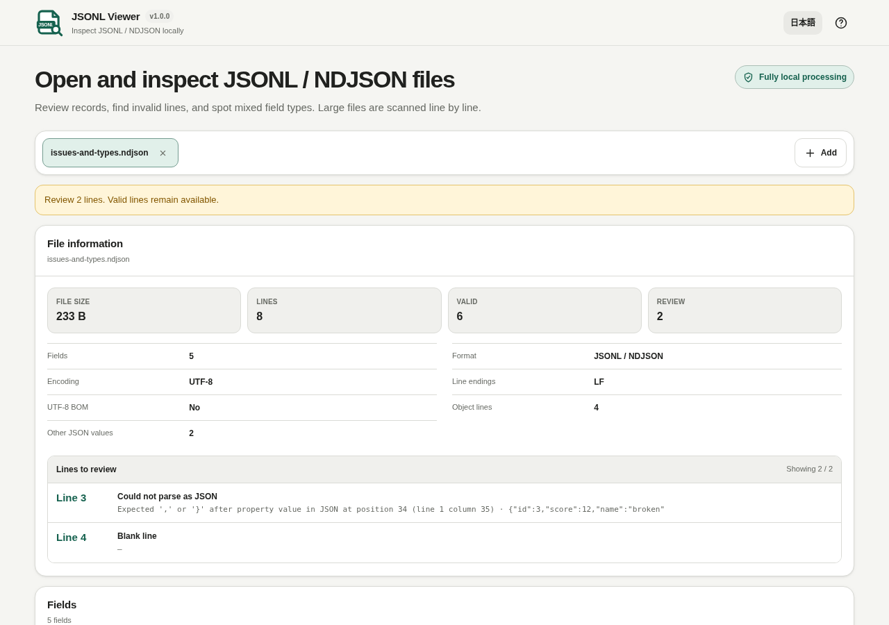

# JSONL Viewer

[](https://github.com/ttomohisa/htmlapps-jsonl-viewer/actions/workflows/deploy-pages.yml)
[](LICENSE)
[](https://ttomohisa.github.io/htmlapps-jsonl-viewer/)

[日本語版 README](README.ja.md)

A privacy-focused, single-HTML viewer for opening JSONL / NDJSON files, finding malformed lines, reviewing top-level field presence and mixed types, and previewing records without uploading selected files to a server.

## 🚀 Live demo

### [Open JSONL Viewer on GitHub Pages](https://ttomohisa.github.io/htmlapps-jsonl-viewer/)

GitHub Pages delivers the initial HTML. After it loads, selected files are read and processed locally on your device. The app does not upload the file contents.

[](https://ttomohisa.github.io/htmlapps-jsonl-viewer/)

## Features

- **Scan large line-delimited files locally** — Analyze `.jsonl`, `.ndjson`, `.jsonl.txt`, and `.ndjson.txt` line by line in a local Blob Worker.
- **Find problematic lines without losing valid data** — Count malformed JSON and blank lines as review-needed while keeping valid records available.
- **Review field presence and type consistency** — Summarize top-level fields, presence rates, observed JSON types, and mixed types such as number / string / null.
- **Avoid holding every parsed record** — Store sparse checkpoints during the initial scan and re-read only the requested page.
- **Switch between Table and Record views** — Inspect current-page data as columns or pretty-printed JSON, with Cell Inspector for full values.
- **Copy one JSON record** — Expand a valid Record and choose **Copy JSON** to copy that line’s original JSON text. Top-level strings are shown with their JSON quotes and escapes.
- **Export the current page** — Copy valid current-page records as JSONL, or copy/save the current page as CSV.
- **Work with multiple files** — Open several files with analysis status, issues, and data isolated per file tab. Close an analyzing tab to cancel its scan while remaining files continue.

Closing the active tab loads the next file’s page automatically. Previously viewed files keep their page and view settings. Copy/save become available only after the page loads; select the tab again to retry a page-read failure.

## Quick start

### Use the web demo

Just [open the demo](https://ttomohisa.github.io/htmlapps-jsonl-viewer/). No installation or account is required.

### Use the standalone HTML

1. Download [`dist/index.html`](https://github.com/ttomohisa/htmlapps-jsonl-viewer/blob/main/dist/index.html) from this repository.
2. Open it directly in a current Chromium-based browser, Firefox, or Safari.

The repository also includes `dist/index.self-extract.html`, a self-extracting single-HTML variant that restores the readable standalone HTML in the browser before the app starts.

### Build it locally

1. Download or clone this repository.
2. Double-click `build-standalone.bat` on Windows.
3. The build generates and verifies `dist/index.html` and `dist/index.self-extract.html`.
4. Open either generated file directly from your device.

Python, Node.js, and a local web server are not required. The builder uses Windows PowerShell and the built-in `tar.exe`.

## Usage

1. Add one or more `.jsonl`, `.ndjson`, `.jsonl.txt`, or `.ndjson.txt` files.
2. Wait for the local scan to report total lines, valid lines, and review-needed lines.
3. Review detected fields, presence rates, and mixed types.
4. Open an issue entry to jump to the affected page when a malformed or blank line is found.
5. Switch between Table and Record views and inspect full cell values when needed.
6. Expand a valid Record and choose **Copy JSON** for that record, or copy valid current-page records as JSONL / copy or save the page as CSV.

Individual-record copy preserves whitespace, large-number spelling, escapes, and duplicate keys without adding a newline. It excludes the initial UTF-8 BOM and line terminator, as the parser does. Review-needed rows have no JSON-copy button. If the browser’s clipboard fallback would change the original text (for example, a literal carriage return inside a record), the action reports failure instead. Cell Inspector still displays and copies the string value without JSON quotes.

## Publish with GitHub Pages

The repository includes a workflow that builds the standalone HTML and deploys `dist/` to GitHub Pages automatically.

1. Push the repository to GitHub as `htmlapps-jsonl-viewer`.
2. Open **Settings → Pages → Build and deployment → Source** and select **GitHub Actions**.
3. Push to `main`, or manually run **Deploy standalone app to GitHub Pages** from the Actions tab.
4. After a successful deployment, the demo is available at `https://ttomohisa.github.io/htmlapps-jsonl-viewer/`.

Each push to `main` runs the repository checks, rebuilds the standalone files, and publishes the verified `dist/` output when GitHub Pages is enabled.

## Development and build layout

```text
.
├─ src/index.template.html       # Application template
├─ app.config.json               # App metadata, version, and build settings
├─ dependencies.json             # Runtime dependency declarations
├─ dependencies.lock.json        # Dependency lock metadata
├─ build-standalone.bat          # Windows build entry point
├─ build-standalone.ps1          # Standalone HTML builder
├─ scripts/check-repository.ps1  # Repository/build verification
├─ dist/index.html               # Readable single-HTML artifact
├─ dist/index.self-extract.html  # Self-extracting single-HTML artifact
└─ .github/workflows/
   ├─ build-standalone.yml       # Build validation
   └─ deploy-pages.yml           # Automatic GitHub Pages deployment
```

### Build and verify

```bat
build-standalone.bat
```

Repository checks can also be run directly:

```powershell
powershell.exe -NoLogo -NoProfile -ExecutionPolicy Bypass -File .\scripts\check-repository.ps1
```

The build/verification flow checks the dependency lock, generates the standalone artifacts, verifies unresolved placeholders and runtime-network restrictions, and builds/verifies the self-extracting variant.

The repository check additionally requires Node.js 22 or newer. It runs dependency-free file/page lifecycle checks against the source, readable HTML, root download, and decompressed self-extract payload, plus release parity checks. These source-level tests do not replace browser, file-picker, layout, or real clipboard testing. The default build refreshes `jsonl-viewer.html`; custom-output builds leave it unchanged.

## Privacy and runtime network protection

The generated standalone HTML includes a Content Security Policy with `connect-src 'none'`. Selected files are read through browser file APIs and stay on the device. The app does not require analytics, telemetry, an external API, or a runtime CDN.

The GitHub Pages version requires one initial request to load the HTML. After that, the files you select are processed locally by the app. For use with the network completely disconnected, open `dist/index.html` directly.

The full-file scan runs in a Blob Worker created from code embedded in the standalone HTML; it does not contact a server.

## Limitations

- `.jsonl.gz` / `.ndjson.gz` are not supported.
- The viewer does not repair or edit the source file.
- Sorting is a current-page operation, not a whole-file operation.
- JSON Schema validation, JSONPath, and jq-style queries are outside the current scope.
- Field statistics focus on top-level fields.

## Dependencies

JSONL Viewer v1.0.0 does not bundle third-party runtime JavaScript libraries.

See [THIRD_PARTY_NOTICES.md](THIRD_PARTY_NOTICES.md) for format/project notices.

## Contributing

Bug reports and feature proposals are welcome through GitHub Issues. See [CONTRIBUTING.md](CONTRIBUTING.md) for development guidance.

## License

Copyright © 2026 ttomohisa

Licensed under the [MIT License](LICENSE).
